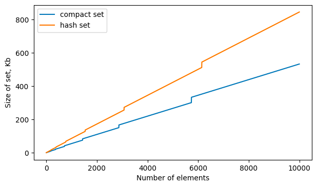
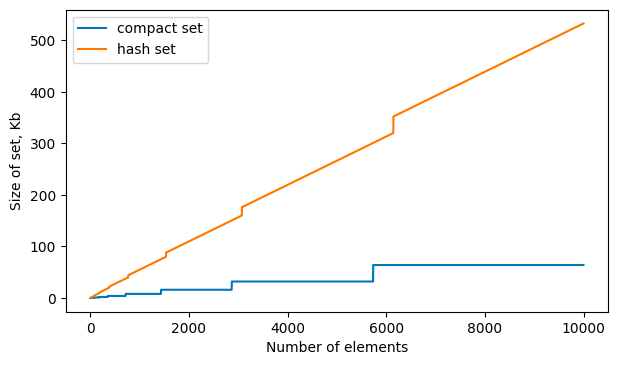

# Compact set

This is tiny implementation of set data structure which is more memory efficient than the standard Java HashSet 
but supports smaller set of operations (only `add` and `contains`).

## Use

Library is not published to Maven central. To use it you need to download sources and build it locally.
Luckily, it's not too difficult.

Pull this git repository and run in the root directory:

```bash
git pull https://github.com/merfemor/compact-set-lib
cd compact-set-lib
./gradlew publishToMavenLocal
```

Add implementation to your build file. Example for Gradle:
```groovy
repositories {
    mavenLocal()
}

dependencies {
    implementation "ru.merfemor.compactset:compact-set-lib:0.1"
}
```

After that it can be used in code:

```kotlin
import ru.merfemor.compactset.newCompactSet

val set = newCompactSet<Int>()
set.add(1)
assertTrue(set.contains(1))
assertTrue(set.size == 1)
```

## Memory consumption test

Memory usage in this implementation was compared with Java standard HashSet.
Object size measured using JOL with code `GraphLayout.parseInstance(setInstance).totalSize()`.
Here are the memory consumption by CompactSet and HashSet after each new element is added.
Initial capacity and expected size were set to 1.

### String



### Int



### Double

